# 🚀 Object-Oriented Programming (OOP) in Java - Complete Foundational Notes

> *"Programming is not about writing instructions anymore; it's about modeling the real world in software."*

---

# 📖 Table of Contents

1. Traditional Programming
2. Problems with Traditional Approach
3. Introduction to Object-Oriented Programming
4. Representing the Real World in Code
5. Classes
6. User-Defined Data Types
7. Creating Objects
8. Compile-Time vs Runtime
9. Characteristics of Objects
10. Naming Conventions in Java
11. Representing Behaviors
12. Physical vs Non-Physical Objects
13. Coding Classes & Objects
14. Understanding the Main Class
15. Complete Mental Model

---

# 1️⃣ Traditional Programming

Before OOP became popular, programs were mostly written using a **procedural approach**.

The focus was on:

* Functions
* Procedures
* Data manipulation

### Example

Imagine a banking system.

```text
deposit()
withdraw()
checkBalance()
```

All functions operate on data stored separately.

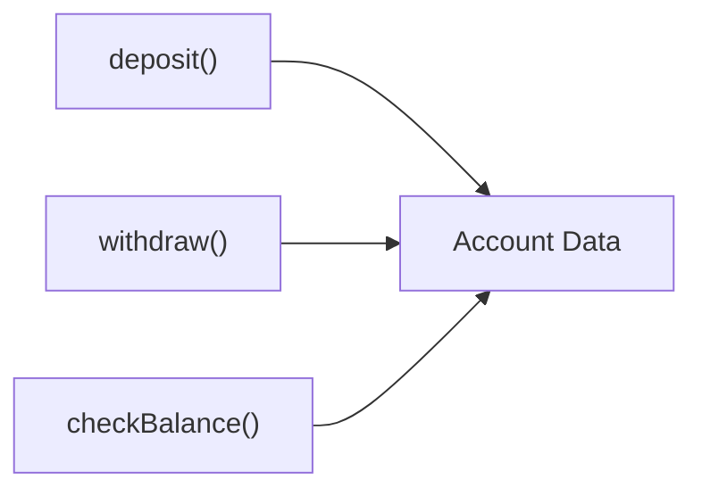

The data and behavior are separate.

---

# 2️⃣ Problems with Traditional Approach

As software grows:

## ❌ Problem 1: Data is exposed

Any function can modify data.

```text
balance = 5000

deposit()
withdraw()
interestCalculation()
salaryCredit()
```

Every function can change balance.

---

## ❌ Problem 2: Difficult Maintenance

Suppose balance calculation changes.

You may need to update multiple functions.

---

## ❌ Problem 3: Poor Real World Representation

In reality:

```text
Car has:
    Color
    Engine
    Speed

and it can:
    Start
    Stop
    Accelerate
```

Procedural programming separates these things unnaturally.

---

## ❌ Problem 4: Code Reusability Issues

Large applications become:

```text
Thousands of variables
Thousands of functions
```

Difficult to manage.

---

# 3️⃣ Object-Oriented Programming (OOP)

OOP solves these issues by combining:

✅ Data
✅ Behavior

into a single unit called an **Object**.

---

## OOP Philosophy

> Everything is modeled as objects.

Instead of:

```text
Functions acting on data
```

we think:

```text
Objects performing actions
```

---

### Real World Example

A Car has:

```text
Data:
    color
    speed
    fuel

Behaviors:
    start()
    stop()
    accelerate()
```

---

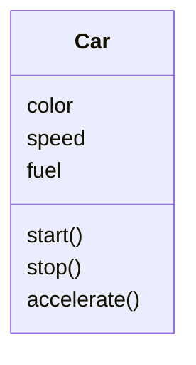

---

# 4️⃣ Representing Real World in Code

The goal of OOP is to mimic reality.

---

## Real World

```text
Student
    name
    age
    rollNo

    study()
    attendClass()
```

---

## Software Representation

```java
class Student {
    String name;
    int age;
    int rollNo;

    void study() {}
    void attendClass() {}
}
```

---

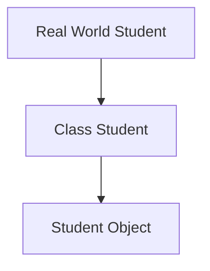

---

# 5️⃣ Classes

## Definition

A **Class** is a blueprint or template used to create objects.

---

### Example

Think of a class as:

```text
Building Blueprint
```

and object as:

```text
Actual Building
```

---

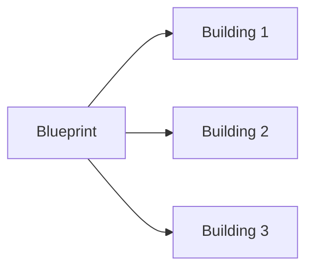

---

### Java Example

```java
class Car {

    String color;
    int speed;

}
```

The class itself does not create a car.

It only defines:

```text
What a car should have
```

---

# 6️⃣ User Defined Data Type

Java already provides:

```java
int
double
char
boolean
```

These are built-in data types.

---

But we can create our own.

Example:

```java
class Student {
    String name;
    int age;
}
```

Now `Student` becomes a new data type.

---

```java
Student s1;
Student s2;
Student s3;
```

Just like:

```java
int x;
int y;
```

---

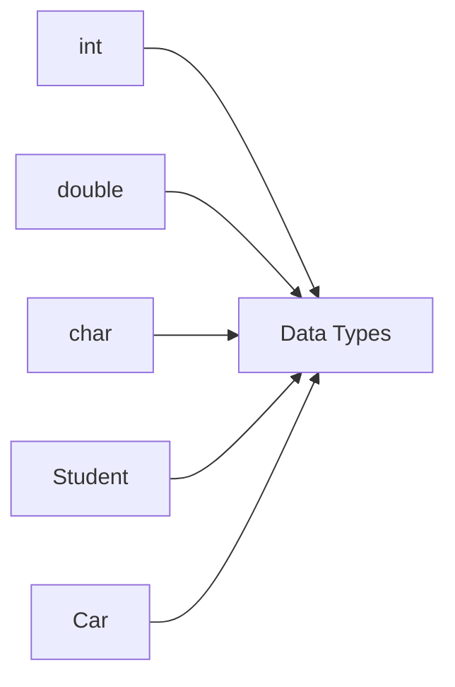

---

# 7️⃣ Creating Objects

A class is only a blueprint.

To use it, we create objects.

---

## Syntax

```java
ClassName reference = new ClassName();
```

---

### Example

```java
Student s1 = new Student();
```

---

### What Happens?

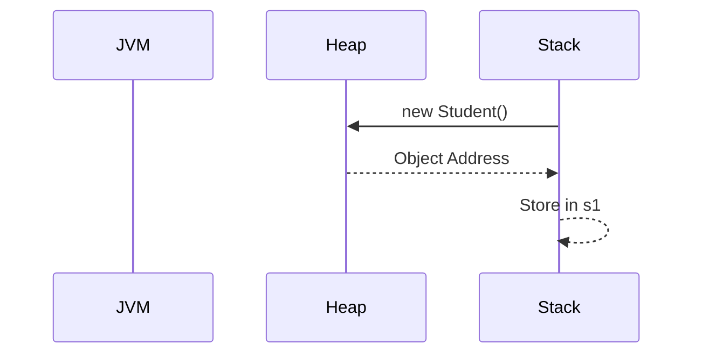

---

### Memory View

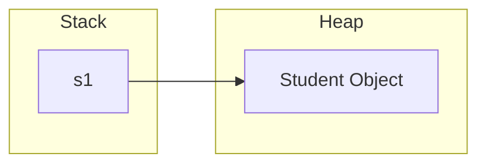

---

# 8️⃣ Compile-Time vs Runtime

This is one of the most important OOP concepts.

---

## Compile-Time

Compiler checks:

```text
Syntax
Variable Names
Method Names
Data Types
```

Example:

```java
Student s1;
```

Compiler only knows:

```text
s1 is a Student reference
```

---

## Runtime

Actual object creation happens.

```java
s1 = new Student();
```

JVM creates memory during execution.

---

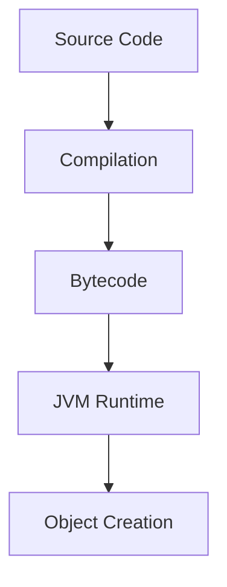

---

# 9️⃣ Characteristics of Objects

Every object has three characteristics.

---

## 1. Identity

Unique existence.

Example:

```text
Student A
Student B
```

Even if data is same, objects are different.

---

## 2. State

Current data stored.

Example:

```text
name = Soumyajit
age = 23
```

State = values of attributes.

---

## 3. Behavior

Actions object can perform.

Example:

```text
study()
sleep()
attendClass()
```

---

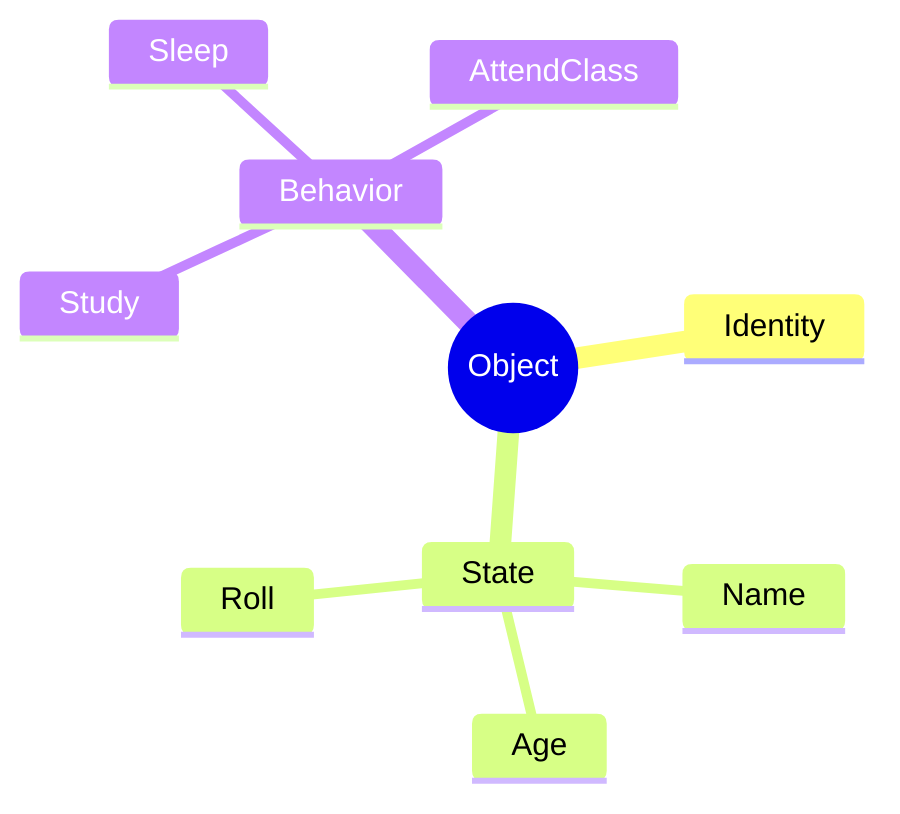

---

# 🔟 Naming Conventions in Java

Following conventions improves readability.

---

## Class Names

Use PascalCase.

```java
Student
BankAccount
EmployeeRecord
```

✅ Good

---

```java
student
bank_account
```

❌ Bad

---

## Variable Names

Use camelCase.

```java
studentName
accountBalance
rollNumber
```

---

## Methods

Use camelCase.

```java
calculateSalary()
withdrawMoney()
printDetails()
```

---

## Constants

Use UPPER_CASE.

```java
MAX_SIZE
PI
DEFAULT_LIMIT
```

---

# 1️⃣1️⃣ Representing Behaviors

Objects don't just store data.

They perform actions.

---

### Example

```java
class Dog {

    String name;

    void bark() {
        System.out.println("Woof");
    }
}
```

---

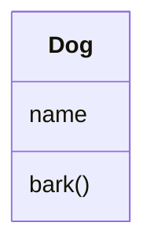

---

### Usage

```java
Dog d = new Dog();

d.bark();
```

Output:

```text
Woof
```

---

# 1️⃣2️⃣ Non-Physical Objects

Not everything in software exists physically.

OOP can model abstract concepts too.

---

## Examples

### Bank Account

```text
accountNumber
balance

deposit()
withdraw()
```

---

### Order

```text
orderId
amount

cancel()
placeOrder()
```

---

### Student Result

```text
marks
grade

calculateGrade()
```

---

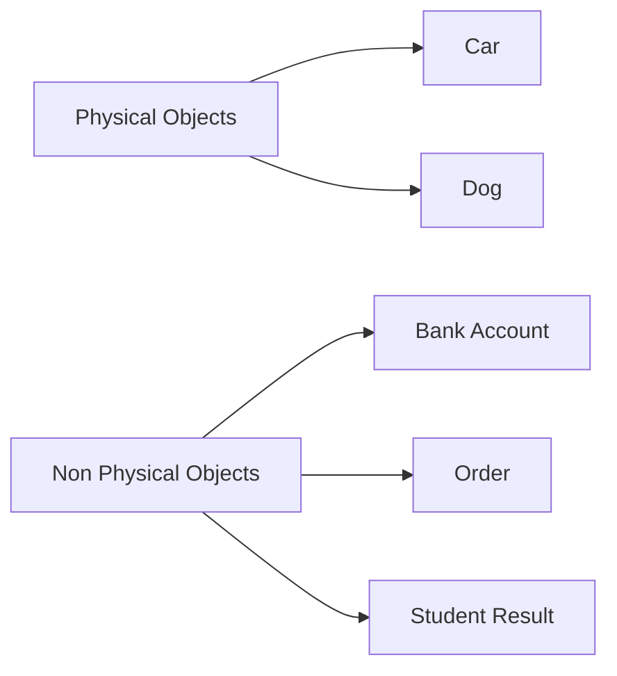

---

# 1️⃣3️⃣ Coding Class & Objects

---

## Class

```java
class Student {

    String name;
    int age;

    void introduce() {
        System.out.println(
            "Name : " + name
        );
    }
}
```

---

## Object Creation

```java
public class Main {

    public static void main(String[] args) {

        Student s1 = new Student();

        s1.name = "Soumyajit";
        s1.age = 23;

        s1.introduce();
    }
}
```

---

### Memory Diagram

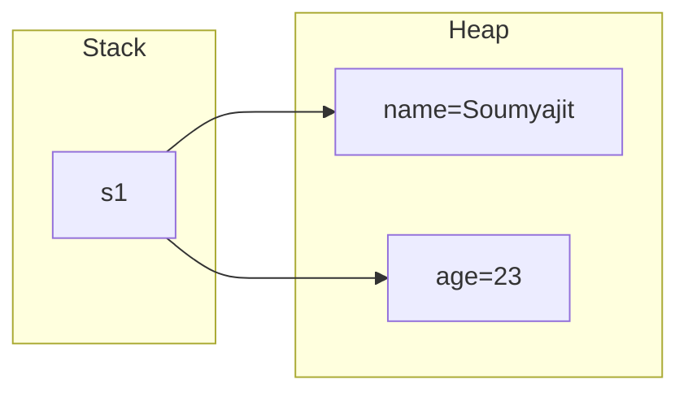

---

# 1️⃣4️⃣ Understanding the Main Class

Every Java application starts execution from:

```java
public static void main(String[] args)
```

---

## Why?

The JVM needs an entry point.

Just like a movie starts from:

```text
Scene 1
```

Java starts from:

```java
main()
```

---

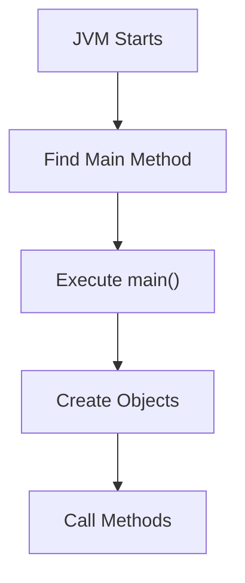

---

### Example

```java
public class Main {

    public static void main(String[] args) {

        Student s1 = new Student();

        s1.name = "Soumyajit";

        s1.introduce();
    }
}
```

---

# 🎯 Complete OOP Flow

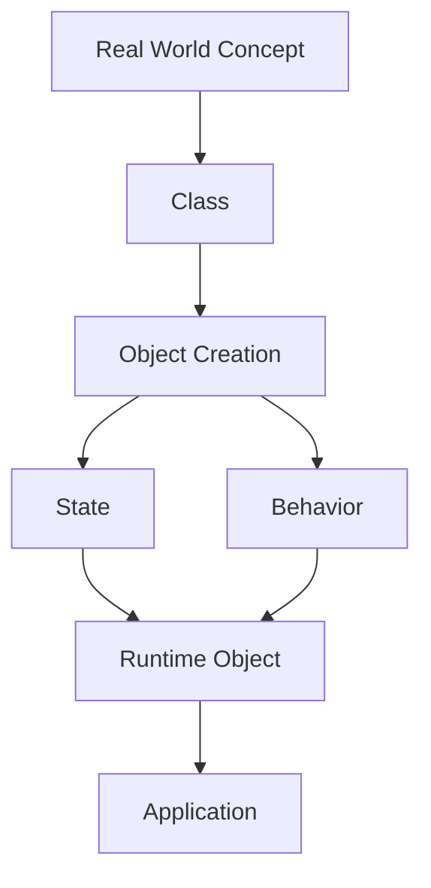

---

# 🏆 Final Summary

| Concept                 | Meaning                         |
| ----------------------- | ------------------------------- |
| Traditional Programming | Focus on functions              |
| OOP                     | Focus on objects                |
| Class                   | Blueprint/Template              |
| Object                  | Real instance of a class        |
| User Defined Data Type  | Custom type created using class |
| State                   | Data of object                  |
| Behavior                | Actions of object               |
| Identity                | Unique existence                |
| Compile-Time            | Code checking by compiler       |
| Runtime                 | Actual execution by JVM         |
| Main Method             | Starting point of Java program  |
| Physical Object         | Car, Dog, Student               |
| Non-Physical Object     | Bank Account, Order, Invoice    |

---

## 🧠 Golden Rule of OOP

```text
Class  = Blueprint

Object = Real Thing Created From Blueprint

Attributes = What the object HAS

Methods = What the object DOES
```

### Example

```text
Student

HAS:
    name
    age
    rollNo

DOES:
    study()
    attendClass()
    writeExam()
```
