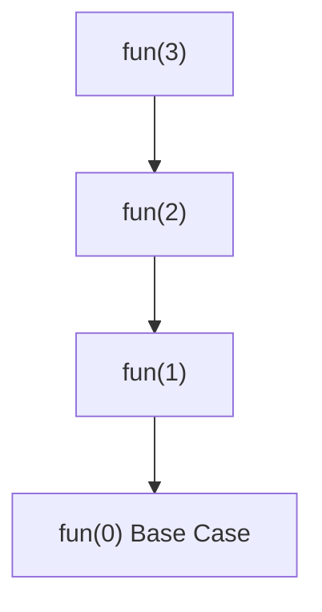
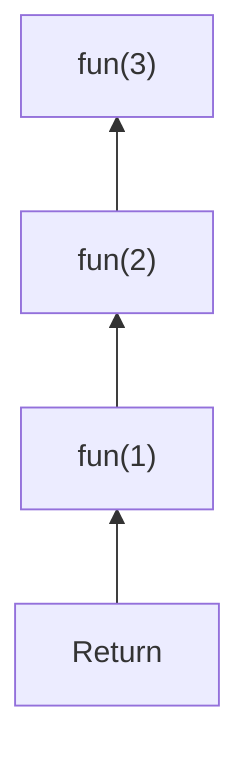
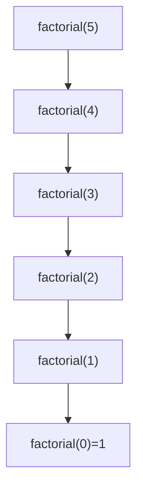
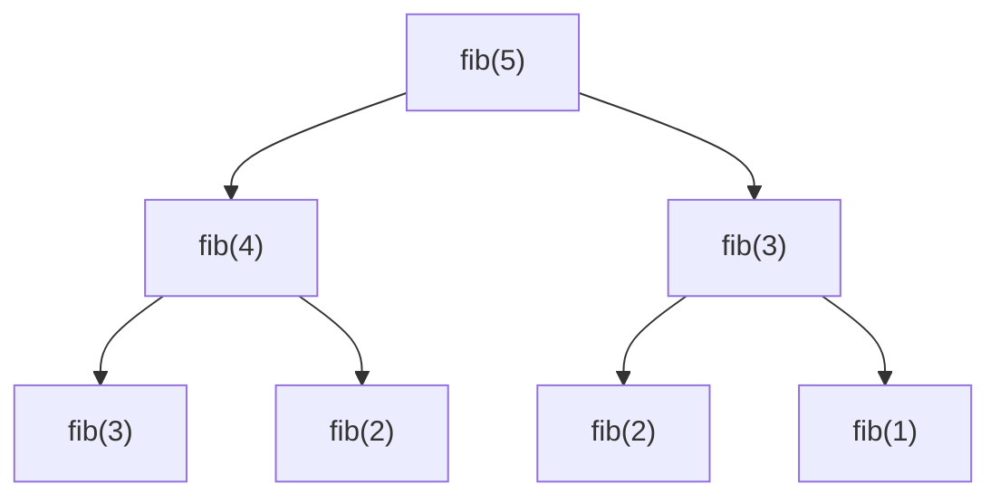

# Recursion in Java - Complete Deep Dive Notes

# Table of Contents

1. Introduction
2. What is Recursion?
3. Real-Life Analogy
4. Components of Recursion
5. How Function Calls Work Internally
6. Call Stack Explained
7. Recursive Flow Visualization
8. Types of Recursion
9. Basic Examples
10. Understanding Recursion Tree
11. Backtracking vs Recursion
12. Tail Recursion
13. Space and Time Complexity
14. Common Problems
15. Advantages and Disadvantages
16. When to Use Recursion
17. Recursion vs Iteration
18. Master Mental Model
19. Interview Tips

---

# 1. Introduction

Recursion is a programming technique where a function calls itself to solve a smaller version of the same problem.

Instead of solving the entire problem at once:

* Solve a smaller problem
* Let recursion solve the remaining part
* Combine the results

Think:

> "To solve problem of size N, solve problem of size N-1."

---

# 2. What is Recursion?

A recursive method is a method that calls itself.

```java
void recursiveMethod() {
    recursiveMethod();
}
```

But this is dangerous because it never stops.

Output:

```text
recursiveMethod()
recursiveMethod()
recursiveMethod()
...
StackOverflowError
```

Therefore every recursion must have:

1. Base Case
2. Recursive Case

---

# 3. Real-Life Analogy

Imagine standing between two mirrors.

You see:

```text
You
 └── You
      └── You
           └── You
```

The image keeps repeating.

Recursion is similar.

A function creates another copy of itself until a stopping condition is reached.

---

# 4. Components of Recursion

Every recursive solution has two parts:

## Base Case

Stopping condition.

```java
if(n == 0)
    return;
```

Without base case:

```java
StackOverflowError
```

---

## Recursive Case

The function calls itself.

```java
function(n - 1);
```

Example:

```java
void print(int n) {

    if(n == 0)
        return;

    System.out.println(n);

    print(n - 1);
}
```

---

# 5. How Function Calls Work Internally

Whenever a method is called:

Java creates a Stack Frame.

A stack frame stores:

* Local variables
* Parameters
* Return address

Example:

```java
print(3);
```

Creates:

```text
Stack

print(3)
```

Then:

```java
print(2);
```

Stack becomes:

```text
print(2)
print(3)
```

Then:

```java
print(1);
```

```text
print(1)
print(2)
print(3)
```

The most recent call stays on top.

This is called:

# Call Stack

---

# 6. Call Stack Explained

Consider:

```java
static void fun(int n){

    if(n==0)
        return;

    fun(n-1);
}
```

Call:

```java
fun(3);
```

Stack growth:

```text
fun(3)
```

↓

```text
fun(2)
fun(3)
```

↓

```text
fun(1)
fun(2)
fun(3)
```

↓

```text
fun(0)
fun(1)
fun(2)
fun(3)
```

Base case reached.

Now stack starts shrinking.

```text
fun(1)
fun(2)
fun(3)
```

↓

```text
fun(2)
fun(3)
```

↓

```text
fun(3)
```

↓

```text
Empty
```

---

# 7. Recursive Flow Visualization



Return flow:



---

# 8. Types of Recursion

## Direct Recursion

Method calls itself.

```java
fun(n-1);
```

Example:

```java
void fun(int n){

    if(n==0)
        return;

    fun(n-1);
}
```

---

## Indirect Recursion

Methods call each other.

```java
A() -> B()
B() -> A()
```

Example:

```java
void A(int n){

    if(n<=0)
        return;

    B(n-1);
}

void B(int n){

    if(n<=0)
        return;

    A(n-1);
}
```

---

## Head Recursion

Recursive call occurs first.

```java
void fun(int n){

    if(n==0)
        return;

    fun(n-1);

    System.out.println(n);
}
```

Output:

```text
1
2
3
4
5
```

---

## Tail Recursion

Recursive call occurs last.

```java
void fun(int n){

    if(n==0)
        return;

    System.out.println(n);

    fun(n-1);
}
```

Output:

```text
5
4
3
2
1
```

---

# 9. Basic Example: Print 1 to N

```java
static void print(int n){

    if(n==0)
        return;

    print(n-1);

    System.out.println(n);
}
```

Call:

```java
print(5);
```

Output:

```text
1
2
3
4
5
```

---

# 10. Factorial

Mathematics:

```text
5! = 5 × 4 × 3 × 2 × 1
```

Observe:

```text
5! = 5 × 4!
4! = 4 × 3!
3! = 3 × 2!
```

Recursive formula:

```text
n! = n × (n-1)!
```

Base case:

```text
0! = 1
```

Code:

```java
static int factorial(int n){

    if(n==0)
        return 1;

    return n * factorial(n-1);
}
```

---

## Recursive Tree



Return:

```text
1
1*1=1
2*1=2
3*2=6
4*6=24
5*24=120
```

---

# 11. Sum of First N Numbers

Mathematics:

```text
sum(5)

= 5 + sum(4)
```

Code:

```java
static int sum(int n){

    if(n==0)
        return 0;

    return n + sum(n-1);
}
```

---

# 12. Fibonacci

Definition:

```text
F(n) = F(n-1) + F(n-2)
```

Base cases:

```text
F(0)=0
F(1)=1
```

Code:

```java
static int fib(int n){

    if(n<=1)
        return n;

    return fib(n-1)+fib(n-2);
}
```

---

## Recursion Tree



Notice:

```text
fib(3) repeated
fib(2) repeated
```

This causes inefficiency.

---

# 13. Understanding Recursion Tree

A recursion tree shows:

* Number of calls
* Repeated work
* Time complexity

Example:

```java
fib(5)
```

Generates many duplicate calls.

This is why Fibonacci recursion:

```text
Time = O(2^n)
```

---

# 14. Backtracking vs Recursion

Many students think both are same.

Not exactly.

Recursion:

```text
Go deeper
Return
```

Backtracking:

```text
Go deeper
Undo
Try another option
```

Example:

* Maze problems
* Sudoku
* N-Queens
* Permutations

Backtracking uses recursion internally.

---

# 15. Tail Recursion

Example:

```java
static void fun(int n){

    if(n==0)
        return;

    System.out.println(n);

    fun(n-1);
}
```

Recursive call is the last statement.

```text
No work remains after recursion returns.
```

Some languages optimize this.

Java does NOT perform tail call optimization.

Therefore:

```text
Tail Recursion still uses stack memory.
```

---

# 16. Space Complexity of Recursion

For:

```java
fun(n)
```

Depth:

```text
n
```

Stack Frames:

```text
n
```

Space:

```text
O(n)
```

Example:

```java
fun(10000)
```

May cause:

```text
StackOverflowError
```

---

# 17. Time Complexity

Example:

```java
fun(n){
    fun(n-1);
}
```

Calls:

```text
n
```

Time:

```text
O(n)
```

---

Factorial:

```text
O(n)
```

---

Fibonacci:

```text
O(2^n)
```

because of repeated calls.

---

# 18. Recursion vs Iteration

## Recursion

```java
int fact(int n){

    if(n==0)
        return 1;

    return n*fact(n-1);
}
```

Pros:

* Elegant
* Natural for trees
* Easy for divide-and-conquer

Cons:

* Extra stack memory
* Slower
* Stack overflow possible

---

## Iteration

```java
int fact(int n){

    int ans=1;

    for(int i=1;i<=n;i++)
        ans*=i;

    return ans;
}
```

Pros:

* Faster
* Less memory

Cons:

* Sometimes harder to design

---

# 19. Master Mental Model

Think of recursion as:

```text
1. Break problem
2. Trust recursion
3. Base case stops
4. Stack remembers state
5. Returns combine answers
```

For factorial:

```text
factorial(5)

= 5 × factorial(4)

Trust recursion to solve factorial(4)

= 5 × 24

= 120
```

Do NOT think:

```text
How factorial(4) works?
```

Trust it.

This is the most important recursive mindset.

---

# 20. Golden Rules of Recursion

Rule 1:

Always define a Base Case.

```java
if(n==0)
    return;
```

---

Rule 2:

Move toward Base Case.

Good:

```java
fun(n-1);
```

Bad:

```java
fun(n+1);
```

---

Rule 3:

Trust the Recursive Call.

Do not manually simulate every level while designing.

---

Rule 4:

Understand Stack Frames.

Every call gets its own:

* Variables
* Parameters
* Execution state

---

Rule 5:

Draw Recursive Trees.

For interviews this is often enough to understand complexity.

---

# Final Definition

Recursion is a problem-solving technique in which a method solves a problem by calling itself on smaller instances of the same problem until a base case is reached. The Java Call Stack automatically keeps track of each pending operation and reconstructs the final answer during the return phase.
