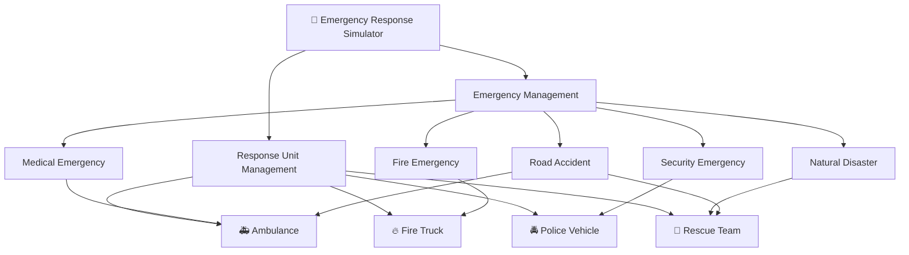
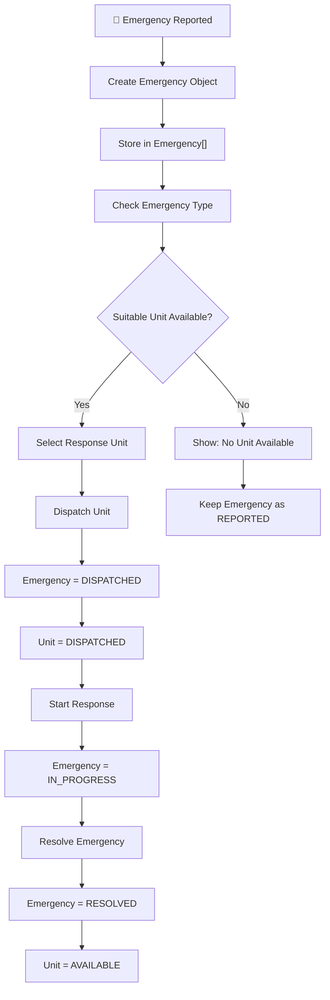
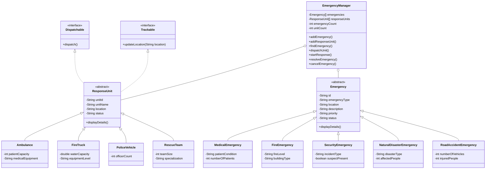

# 🚨 Emergency Response Simulator

## Java OOP Mini Project

> **Difficulty:** Intermediate <br>
> **Language:** Java <br>
> **Project Type:** Console-Based Application <br>
> **Focus:** Object-Oriented Programming <br>
> **Storage:** Array of Objects <br>
> **Database:** Not Required

---

# 📌 1. Project Overview

Imagine you are developing a simplified **Emergency Response Management System** for an emergency control center.

Whenever an emergency is reported, the system should record the emergency details and help the control center assign a suitable response unit.

The system should support different types of emergencies such as:

* 🚑 Medical Emergency
* 🔥 Fire Emergency
* 🚔 Security Emergency
* 🌊 Natural Disaster
* 🚗 Road Accident

Different emergencies require different response units.

For example:

```text
Medical Emergency    →  Ambulance
Fire Emergency       →  Fire Truck
Security Emergency   →  Police Vehicle
Natural Disaster     →  Rescue Team
Road Accident        →  Ambulance / Rescue Team
```

Your task is to design and implement this system using **Java OOP concepts**.

---

# 🎯 2. Learning Objectives

By completing this project, you should be able to demonstrate:

* Classes and Objects
* Constructors
* Encapsulation
* Inheritance
* Abstract Classes
* Interfaces
* Method Overriding
* Runtime Polymorphism
* Object Arrays
* `String` handling
* Conditional statements
* Loops
* Basic Exception Handling

---

# 🏗️ 3. System Architecture



---

# 🧩 4. Required Classes

You must create the following classes.

## Emergency Hierarchy

```text
Emergency
    |
    |-- MedicalEmergency
    |-- FireEmergency
    |-- SecurityEmergency
    |-- NaturalDisasterEmergency
    |-- RoadAccidentEmergency
```

## Response Unit Hierarchy

```text
ResponseUnit
    |
    |-- Ambulance
    |-- FireTruck
    |-- PoliceVehicle
    |-- RescueTeam
```

---

# 📦 5. Emergency Abstract Class

Create an abstract class:

```java
abstract class Emergency
```

It should contain the following private fields:

| Field           | Type   | Description              |
| --------------- | ------ | ------------------------ |
| `id`            | String | Unique emergency ID      |
| `emergencyType` | String | Type of emergency        |
| `location`      | String | Emergency location       |
| `description`   | String | Description of incident  |
| `priority`      | String | Emergency priority       |
| `status`        | String | Current emergency status |

### Possible Emergency Types

```text
Medical
Fire
Security
Natural Disaster
Road Accident
```

### Possible Priorities

```text
LOW
MEDIUM
HIGH
CRITICAL
```

### Possible Status

```text
REPORTED
DISPATCHED
IN_PROGRESS
RESOLVED
CANCELLED
```

---

# 🔐 6. Encapsulation Requirements

All fields in `Emergency` must be:

```java
private
```

Provide appropriate:

```text
Constructor
Getters
Setters
```

Do not directly access fields from outside the class.

For example:

```java
emergency.location
```

is **not allowed**.

Instead:

```java
emergency.getLocation()
```

should be used.

---

# 🧬 7. Emergency Subclasses

Create the following subclasses:

```java
MedicalEmergency
FireEmergency
SecurityEmergency
NaturalDisasterEmergency
RoadAccidentEmergency
```

Each class must extend:

```java
Emergency
```

Example:

```java
class MedicalEmergency extends Emergency {

}
```

However, don't create empty subclasses only for inheritance.

Each subclass should have at least **one meaningful behavior or property** related to its emergency type.

### Examples

#### MedicalEmergency

Additional information could include:

```text
patientCondition
numberOfPatients
```

#### FireEmergency

Additional information could include:

```text
fireLevel
buildingType
```

#### SecurityEmergency

Additional information could include:

```text
incidentType
suspectPresent
```

#### NaturalDisasterEmergency

Additional information could include:

```text
disasterType
affectedPeople
```

#### RoadAccidentEmergency

Additional information could include:

```text
numberOfVehicles
injuredPeople
```

You don't have to use exactly these properties. Design them yourself.

---

# 🚑 8. ResponseUnit Abstract Class

Create:

```java
abstract class ResponseUnit
```

Private fields:

| Field      | Type   |
| ---------- | ------ |
| `unitId`   | String |
| `unitName` | String |
| `location` | String |
| `status`   | String |

Possible unit status:

```text
AVAILABLE
DISPATCHED
BUSY
MAINTENANCE
```

---

# 🚨 9. Response Unit Subclasses

Create:

```text
Ambulance
FireTruck
PoliceVehicle
RescueTeam
```

All must extend:

```java
ResponseUnit
```

---

## 🚑 Ambulance

Additional properties could include:

```text
patientCapacity
medicalEquipment
```

Example:

```text
Unit ID: A101
Name: Ambulance 01
Location: Bardhaman
Status: AVAILABLE
Patient Capacity: 2
Medical Equipment: Advanced
```

---

## 🔥 Fire Truck

Additional properties:

```text
waterCapacity
equipmentLevel
```

Example:

```text
Unit ID: F101
Name: Fire Truck 01
Location: Bardhaman
Status: AVAILABLE
Water Capacity: 5000 Litres
Equipment Level: Advanced
```

---

## 🚔 Police Vehicle

Additional property:

```text
officerCount
```

Example:

```text
Unit ID: P101
Name: Police Vehicle 01
Location: Bardhaman
Status: AVAILABLE
Officers: 4
```

---

## 🛟 Rescue Team

Additional properties:

```text
teamSize
specialization
```

Example:

```text
Unit ID: R101
Name: Rescue Team 01
Location: Bardhaman
Status: AVAILABLE
Team Size: 8
Specialization: Disaster Rescue
```

---

# 🔌 10. Create an Interface

Create:

```java
interface Dispatchable
```

It should contain:

```java
void dispatch();
```

Response units should implement this interface.

You may decide whether `ResponseUnit` itself or its subclasses should implement the interface.

**Be prepared to explain your decision.**

---

# 📍 11. Trackable Interface

Create another interface:

```java
interface Trackable
```

It should contain:

```java
void updateLocation(String location);
```

Use this interface for classes that can change their location.

---

# 🧠 12. Emergency Manager

Create a class:

```java
EmergencyManager
```

This class is responsible for managing emergencies and response units.

#### use:

```java
Emergency[] emergencies;
ResponseUnit[] responseUnits;
```

---

# 📚 13. Object Arrays

`EmergencyManager` should maintain:

```java
private Emergency[] emergencies;
private ResponseUnit[] responseUnits;
```

For example:

```java
Emergency[] emergencies = new Emergency[20];

ResponseUnit[] responseUnits = new ResponseUnit[20];
```

The arrays should be capable of storing different child objects.

For example:

```java
emergencies[0] = new MedicalEmergency(...);
emergencies[1] = new FireEmergency(...);
emergencies[2] = new SecurityEmergency(...);
```

This should work because:

```text
MedicalEmergency
       ↓
   Emergency
```

and:

```text
FireEmergency
       ↓
   Emergency
```

---

# 🔄 14. Runtime Polymorphism

Your application must demonstrate runtime polymorphism.

For example:

```java
Emergency emergency;

emergency = new MedicalEmergency(...);
```

and:

```java
emergency = new FireEmergency(...);
```

The same reference:

```java
Emergency
```

should be able to refer to different child objects.

Similarly:

```java
ResponseUnit unit;

unit = new Ambulance(...);
unit = new FireTruck(...);
unit = new PoliceVehicle(...);
```

---

# 🚨 15. Emergency Reporting

The system should allow the user to report an emergency.

Example:

```text
========================================
       REPORT EMERGENCY
========================================

1. Medical
2. Fire
3. Security
4. Natural Disaster
5. Road Accident

Enter emergency type: 1

Enter location: Bardhaman
Enter description: Person injured in road accident
Enter priority: CRITICAL

Emergency reported successfully.

Emergency ID: E101
Status: REPORTED
```

---

# 🚒 16. Dispatching a Response Unit

When an emergency needs assistance, the system should identify a suitable response unit.

Example:

```text
Emergency ID: E101
Emergency Type: Medical
Priority: CRITICAL

Searching for available response unit...

Available units:

A101 - Ambulance 01 - AVAILABLE
A102 - Ambulance 02 - BUSY
F101 - Fire Truck 01 - AVAILABLE
P101 - Police Vehicle 01 - AVAILABLE
```

The system should select an appropriate unit.

```text
Selected Unit:

A101 - Ambulance 01

Dispatch successful.
```

The emergency status should change:

```text
REPORTED
    ↓
DISPATCHED
```

And the unit status should change:

```text
AVAILABLE
    ↓
DISPATCHED
```

---

# 🚑 17. Start Response

The system should allow the user to start the response.

Example:

```text
Enter Emergency ID: E101

Emergency E101 is now IN_PROGRESS.

Response Unit A101 is now BUSY.
```

---

# ✅ 18. Resolve Emergency

Once the emergency is handled:

```text
Enter Emergency ID: E101

Emergency E101 has been resolved.

Emergency Status: RESOLVED
Response Unit A101: AVAILABLE
```

The response unit should become available again.

```text
BUSY
 ↓
AVAILABLE
```

---

# ❌ 19. Cancel Emergency

The user should be able to cancel an emergency.

Example:

```text
Enter Emergency ID: E102

Are you sure you want to cancel this emergency?
Y/N: Y

Emergency E102 has been CANCELLED.
```

---

# 🔎 20. Search Emergency

The system should allow searching by emergency ID.

Example:

```text
Enter Emergency ID: E101

--------------------------------
Emergency Details
--------------------------------
ID          : E101
Type        : Medical
Location    : Bardhaman
Priority    : CRITICAL
Status      : IN_PROGRESS
Description : Person injured
--------------------------------
```

If the emergency doesn't exist:

```text
Emergency E999 not found.
```

---

# 🚨 21. Response Unit Matching

The system should follow these basic rules:

| Emergency        | Suitable Unit           |
| ---------------- | ----------------------- |
| Medical          | Ambulance               |
| Fire             | Fire Truck              |
| Security         | Police Vehicle          |
| Natural Disaster | Rescue Team             |
| Road Accident    | Ambulance / Rescue Team |

If a suitable unit is unavailable:

```text
No suitable response unit is currently available.
```

---

# 📋 22. Main Menu

The final application should provide:

```text
╔══════════════════════════════════════╗
║      🚨 EMERGENCY RESPONSE SYSTEM    ║
╠══════════════════════════════════════╣
║                                      ║
║  1. Report Emergency                 ║
║  2. View All Emergencies             ║
║  3. View Available Units             ║
║  4. Dispatch Response Unit           ║
║  5. Start Response                   ║
║  6. Resolve Emergency                ║
║  7. Cancel Emergency                 ║
║  8. Search Emergency                 ║
║  9. Search Response Unit             ║
║ 10. View Emergency Details           ║
║ 11. View Unit Details                ║
║  0. Exit                             ║
║                                      ║
╚══════════════════════════════════════╝

Enter your choice:
```

---

# 🔁 23. Overall System Flow



---

# 🧬 24. Class Relationship Diagram



---

# 🧪 25. Sample Data

Before asking the user for input, you may initialize some response units.

Example:

```text
A101 → Ambulance 01 → Bardhaman → AVAILABLE
A102 → Ambulance 02 → Kalna → BUSY

F101 → Fire Truck 01 → Bardhaman → AVAILABLE

P101 → Police Vehicle 01 → Katwa → AVAILABLE

R101 → Rescue Team 01 → Bardhaman → AVAILABLE
```

You may create these objects directly in the program.

---

# ⚠️ 26. Validation Requirements

Your program should handle invalid input.

Examples:

### Invalid priority

```text
Enter priority: SUPER

Invalid priority.
Please enter LOW, MEDIUM, HIGH or CRITICAL.
```

### Empty location

```text
Location cannot be empty.
```

### Invalid emergency ID

```text
Emergency E999 does not exist.
```

### No available unit

```text
No suitable response unit is currently available.
```

### Full array

If the emergency array is full:

```text
Cannot add emergency.
Emergency storage is full.
```

---

# 🛑 27. Project Requirements

To keep this project focused on the topics already learned, **use**:

```text
✅ Classes
✅ Objects
✅ Constructors
✅ Methods
✅ Strings
✅ Arrays
✅ Abstract Classes
✅ Interfaces
✅ Inheritance
✅ Method Overriding
✅ Encapsulation
✅ Polymorphism
✅ if/else
✅ switch
✅ for loop
✅ while loop
✅ Scanner
```

---

# 🧠 28. Mandatory OOP Demonstration

Your project will not be considered complete just because the menu works.

You must be able to explain where you used:

### Encapsulation

Where did you use `private` fields?

### Abstraction

Why are `Emergency` and `ResponseUnit` abstract?

### Inheritance

Which classes inherit from them?

### Polymorphism

Show an example where:

```java
Emergency reference
```

holds different child objects.

### Method Overriding

Which methods are overridden?

### Interface

Why did you create `Dispatchable` and `Trackable`?

### Object Array

How can:

```java
Emergency[]
```

store:

```text
MedicalEmergency
FireEmergency
SecurityEmergency
```

?

---

# 🏆 29. Bonus Challenges

After completing the basic version, try these challenges.

## Challenge 1 — Multiple Units

Allow one emergency to require multiple units.

Example:

```text
Major Road Accident

Required:
1 Ambulance
1 Rescue Team
1 Police Vehicle
```

---

## Challenge 2 — Unit Location

Allow units to change their location.

Example:

```text
A101

Old Location: Bardhaman
New Location: Kalna
```

Use the `Trackable` interface.

---

## Challenge 3 — Emergency History

Maintain resolved/cancelled emergencies inside the same object array.

Do not use Collections.

---

## Challenge 4 — Nearest Unit

Give every response unit a distance from the emergency.

Example:

```text
A101 → 10 km
A102 → 5 km
A103 → 2 km
```

Select:

```text
A103
```

because it is closest.

---

# ⭐ 30. Final Expected Flow

A complete demonstration should look approximately like this:

```text
START
  ↓
Report Emergency
  ↓
Create Emergency Object
  ↓
Store in Emergency[]
  ↓
Find Suitable Response Unit
  ↓
Check Unit Status
  ↓
Dispatch
  ↓
Start Response
  ↓
Resolve Emergency
  ↓
Release Response Unit
  ↓
Unit becomes AVAILABLE
  ↓
END
```

---

# 🎯 Final Challenge

Once the project is completed, you should be able to answer this question:

> **Why did we create an abstract `Emergency` class instead of simply creating five independent classes?**

And this one:

> **How does `Emergency[]` demonstrate runtime polymorphism when it contains `MedicalEmergency`, `FireEmergency`, and `SecurityEmergency` objects?**

If you can explain those two questions clearly **and** your program works, you've successfully applied the major Java OOP concepts covered in this project.
